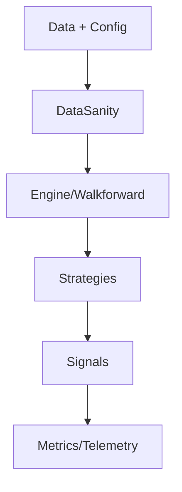

# Core Module — Summary

Purpose: Core runtime, engine, data sanity, metrics, and walkforward orchestration.

Entrypoints:
- `core/data_sanity/api.py` — DataSanity API (engine switch facade, telemetry, metrics)
- `core/engine/` — strategy engines and execution plumbing
- `core/walkforward/` — fold builder, pipeline orchestration

Do-not-touch:
- Contracts under `core/data_sanity/main.py` and public symbols exported by `core/data_sanity/api.py`
- Fold builder contracts and walkforward invariants

### API (selected public)
- `DataSanityValidator`
- `ValidationResult`
- `DataSanityGuard`
- `DataSanityWrapper`
- `validate_market_data`
- `get_data_sanity_wrapper`
- `attach_guard`
- `get_guard`
- `assert_validated`
- `map_ohlcv`
- `enforce_groupwise_time_order`
- `repair_nonfinite_ohlc`
- `coerce_ohlcv_numeric`
- `canonicalize_datetime_index`
- `emit_validation_telemetry`
- `get_telemetry_stats`
- `bump`
- `get_metrics`
- `reset_metrics`
- `export_metrics`
- `validate_and_repair_with_engine_switch`

