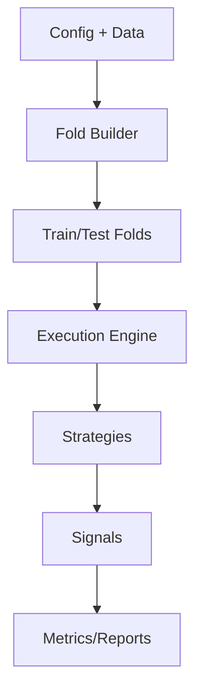

# Engine/Walkforward — Summary

Purpose: Build folds, orchestrate walkforward runs, and execute strategies with DataSanity enforcement.

Entrypoints:
- `scripts/multi_walkforward_report.py` — smoke/backtest runner
- `apps/walk_cli.py` — CLI entry
- Engine modules under `core/` (fold builder, execution)

Do-not-touch:
- Fold builder contracts and short-fold policy
- Determinism knobs and seed handling

