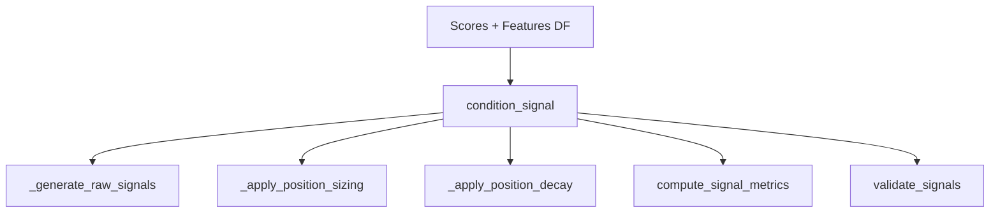

# Signals Module — Summary

Purpose: Convert model scores and features into tradable signals with sizing, decay, and validation.

Entrypoints:
- `signals/condition.py` — main API for signal conditioning and metrics

Do-not-touch:
- Public API surface documented below; preserve function signatures used by strategies

### API (selected public)
- `condition_signal(df, score_col, vol_col, conf_q, max_hold, decay, target_vol, position_cap, ts_col, asset_col)`
- `compute_signal_metrics(df, pos_col, ret_col, ts_col, asset_col)`
- `validate_signals(df, pos_col)`
